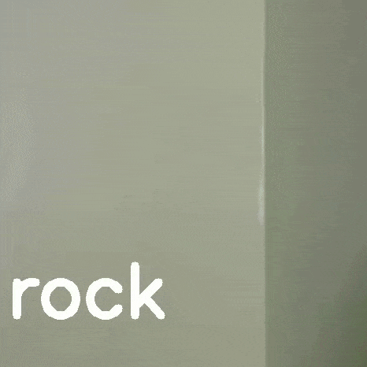

# rock-paper-scissors-live

## Live working sample
After training, you'll get something like this:

In the `datasets` folder, you'll need to create three folders `rock`, `paper` and `scissors`. Then, shoot a video of your hand using your webcam, show the three classes for some amount of time in various angles. After the video is made, copy the video to the `datasets` folder. Split all the frames of the video using `ffmpeg -i input.mp4 img%04d.png`, then cut-paste the proper images in proper folders. Finally, run the `1. Preparing Data` Notebook and then run `2. Preparing the model`. The last cell of the second notebook contains the code to live-predict your hand gesture.
